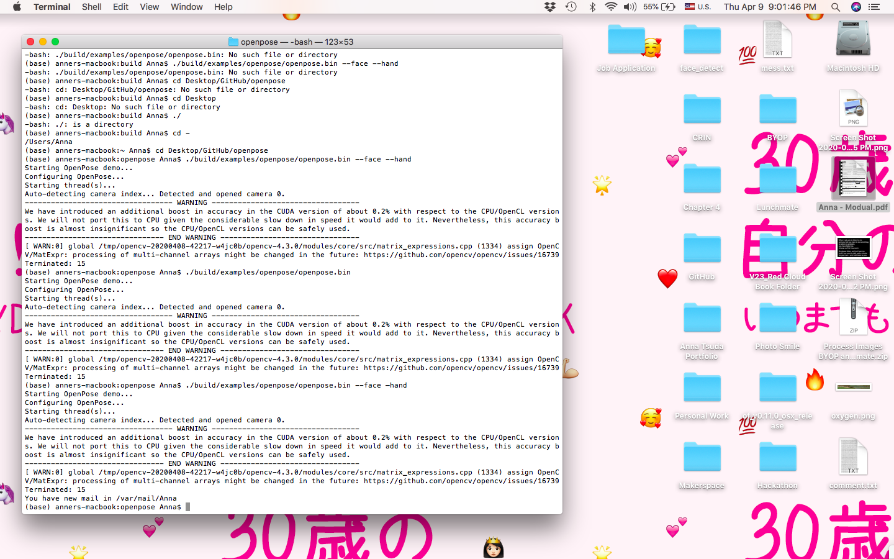
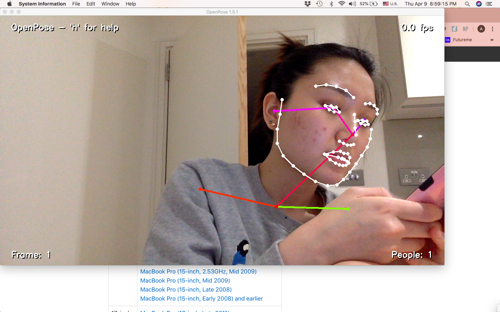
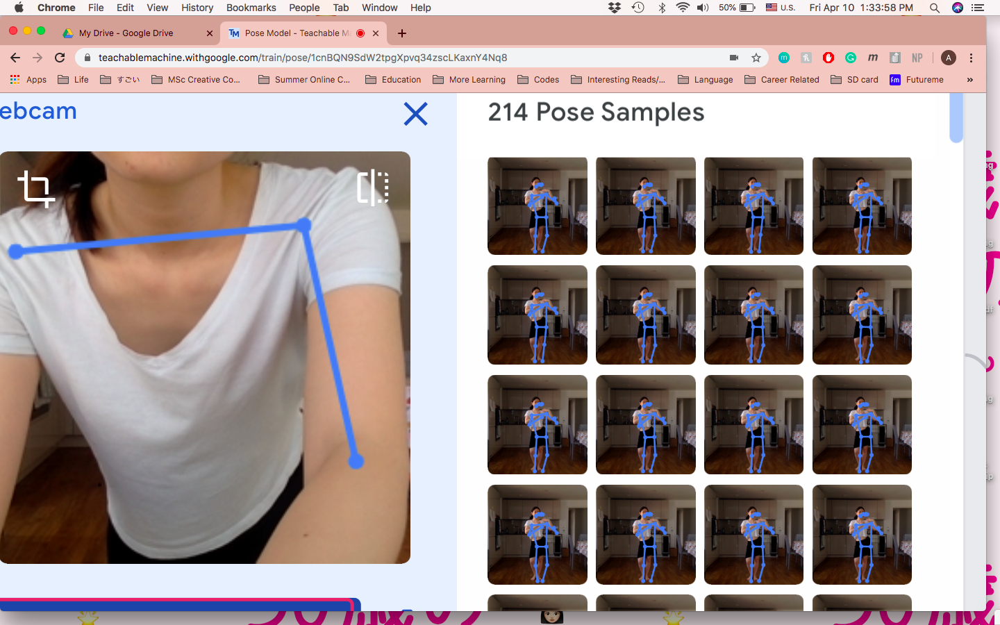

# Final Project 

### Introduction

Pua Beach is a platform that helps Hawaiian dancers to immerse themselves in the story by live painting the scenary right in front of you. If you dance in front of your webcam, the trained model will detect different hand and arm motions and will output the corresponding visuals on your screen. 

When the trained model detects the pua (or flower in English) gesture, which is currently the only gesture it can detect, flowers randomly varying in x coordinate, y coordinate, radius, number of petals and color will appear on the screen.

I wasn't able to get the code to fully work as I envisioned, therefore, have created a short [prototype video](https://youtu.be/VsGPTUusaJo), showing what I attempted to achieve.

### Opening the Project

To view the project ↓  
Final Project > Pua Beach Website > index.html (open with Google Chrome)

To view the demo video ↓  
[Prototype Video](https://youtu.be/VsGPTUusaJo)  
  
### Documentation

#### Inspiration

Every single Hawaiian dance teacher that I have met in the past 12 years of my dancing career has told me that in order to become a true performer, it is incredibly important to envision the scenary written in the lyrics, place yourself in that environment and to tell that story through your finger tips. However it is way easier said than done!

My experience as a Hawaiian dancer initially inspired me to work on this project. My primary objective is to facilitate dancers like myself to better visualise the scenary to become a better performer and my secondary objective is to translate hand and arm motions into visual illustrations for the audience (who might be less familiar with the Hawaiian language) to better understand the story behind the dance.

#### Experimenting with Openpose and Issues

I started off this project by researching different tools I can use to detect body movement through the webcam, more specifically arm movement and hand/finger gestures. Although I came across many tools that detect arm movement, there weren't many that detects the precise movement of your hand/finger gestures.  
  
Through my research, it seemed that Openpose would provide me with the most accurate detection of finger gestures and I attempted to run it on my (very old) laptop, despite knowing that my MacBook Air doesn't have the minimum required RAM memory space. I was hoping that it might partially work, but it caused my laptop to freeze and crash.
  
Below are screenshots of when I was trying to install Openpose, which to my surprise had many steps and took a very long time just to get it set up.  
  
;
;

#### Collecting the Dataset and Teachable Machines

Since Openpose was off the table, and through my understanding, there weren't other accurate body detection tools that I can run on my laptop, I decided to use Teachable Machines as I can train my model straight on their website.   
  
Before training the model, I reviewed through all the Hawaiian dance songs that I have learnt the choreography to in the past years and collated all of the hand/arm motions that signified a flower or a lei (traditional flower necklace) as shown in the image below.  
  
;  
  
I then used my webcam to collect around 1500 images of my body position when performing the flower gesture, and another 1500 neutral images of gestures that are not talking about the flower. Below is an image of when I was collecting these images.  
  
;  

#### Embedding into Website

#### Next Steps