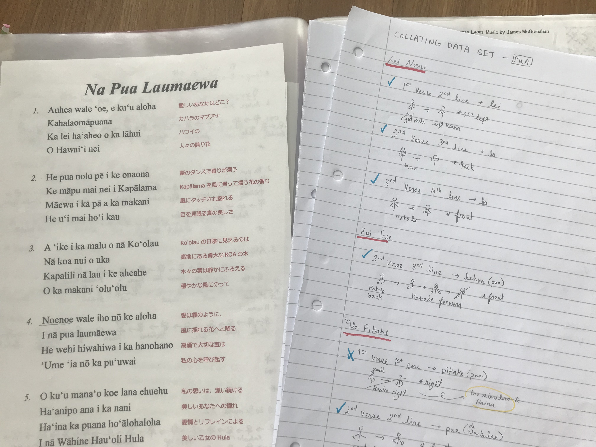
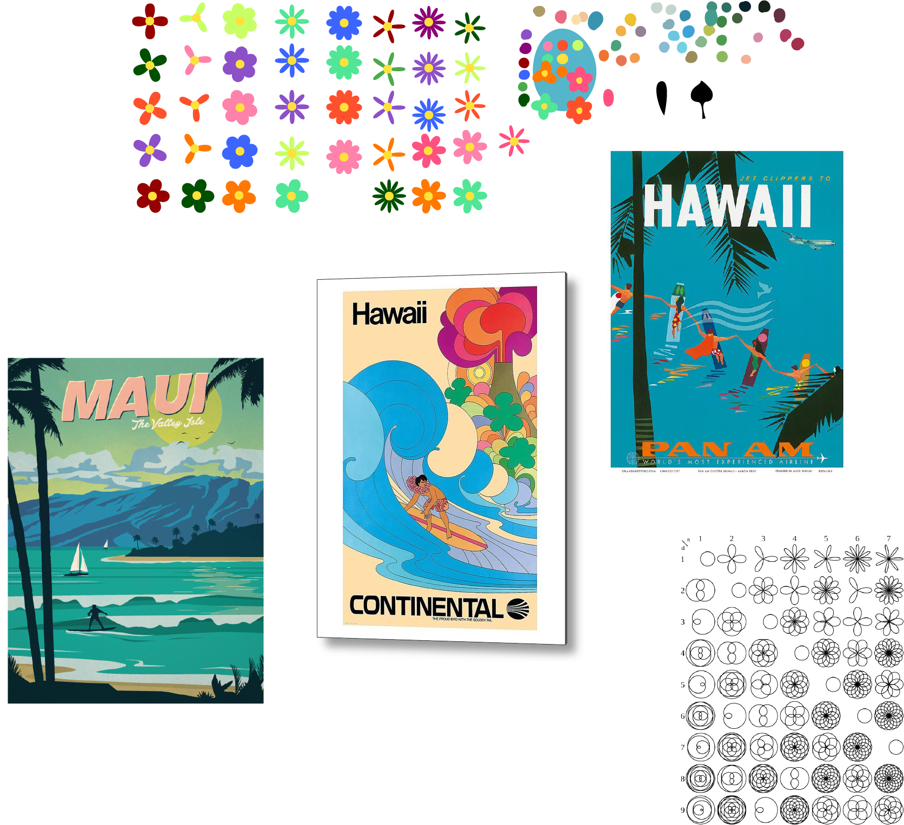

# Final Project 

## Introduction

Pua Beach is a platform that helps Hawaiian dancers to immerse themselves in the story by live painting the scenary right in front of you. If you dance in front of your webcam, the trained model will detect different hand and arm motions (much like sign languages) and will output the corresponding visuals on your screen. 

When the trained model detects the pua (or flower in English) gesture, which is currently the only gesture it can detect, flowers randomly varying in x coordinate, y coordinate, radius, number of petals and color will appear on the screen.

I wasn't able to get the code to fully work as I envisioned, therefore, have created a short [prototype video](https://youtu.be/4CYhXMyAsOU), showing what I attempted to achieve. To briefly explain what is working, a random flower appears on the screen when a pua (flower) gesture is detected with a confidence of 0.50 to 1.00. However, I had a lot of difficulty trying to get multiple flowers to continously appear on the screen during this if condition.

## Opening the Project

To view the project ↓  
Coding2-FinalProject > Pua Beach Website > index.html (open with Google Chrome)

To view the demo video ↓  
[Prototype Video](https://youtu.be/4CYhXMyAsOU)  
  
## Documentation

### Inspiration

Every single Hawaiian dance teacher that I have met in the past 12 years of my dancing career has told me that in order to become a true performer, it is incredibly important to envision the scenary written in the lyrics, place yourself in that environment and to tell that story through your finger tips. However it is way easier said than done!

My experience as a Hawaiian dancer initially inspired me to work on this project. My primary objective is to facilitate dancers like myself to better visualise the scenary to become a better performer and my secondary objective is to translate hand and arm motions into visual illustrations for the audience (who might be less familiar with the Hawaiian language) to better understand the story behind the dance.

### Experimenting with Tools and Issues

I started off this project by researching different tools I can use to detect body movement through the webcam, more specifically arm movement and hand/finger gestures. Although I came across many tools that detect arm movement, there weren't many that detects the precise movement of your hand/finger gestures.  
  
Through my research, it seemed that Openpose would provide me with the most accurate detection of finger gestures and I attempted to run it on my (very old) laptop, despite knowing that my MacBook Air doesn't have the minimum required RAM memory space. I was hoping that it might partially work, but it caused my laptop to freeze and crash.
  
Below are screenshots of when I was trying to install Openpose, which to my surprise had many steps and took a very long time just to get it set up. I also considered other methods such as using a Raspberry Pi, but didn't have the appropriate monitor to work with. 
  
 
  
  
  
### Collecting the Dataset and Teachable Machines

Since the above methods were off the table, and through my understanding, there weren't other accurate body detection tools that I can run on my laptop, I decided to use Teachable Machines as I can train my model straight on their website.  
  
Before training the model, I reviewed through all the Hawaiian dance songs that I have learnt the choreography to in the past years and collated all of the hand/arm motions that signified a flower or a lei (traditional flower necklace) as shown in the image below.  
  
  
  
I then used my webcam to collect around 1800 images of my body position when performing the flower gesture, and another 1700 neutral images of gestures that are not talking about the flower. Below is an image of when I was collecting these images.  
  
  

### Visual Identity

Before embedding the trained model so that it would be used through a webpage, I worked on a very simple moodboard to decide on the visual identity I wanted to use for this project, as shown below. At this stage, I also brainstormed the aesthetic style I wanted to go for the flowers being output on the screen when the pua gesture is detected. I initially thought of using svg illustrations of flower petals designed on Illustrator, as this would give it a more organic and hand painted style, but decided to use the Geo Rose equation so that I would be able to explore and work more with algorithmic equations.  
  
 
  
### Embedding into Website
  
I then moved onto developing the website and one of the main challenges was that I couldn't make *multiple* flowers to appear on screen at random locations on the canvas. As shown in the code snippet above, I attempted to use a while loop within a condition (of when the pua gesture is detected with a confidence of above 0.5). However, including this while loop (although with an interval of 2 seconds in between) led to my laptop freezing and crashing. I am not sure as to if I would have been able to achieve my desired output on a different device or with a larger memory space. 
  
    //if the Pua class is in between 0.5 to 1.0
    if (prediction[0] && prediction[0].probability.toFixed(2) > 0.5) {
        while (prediction[0].probability.toFixed(2) > 0.5) {
            setInterval (function() {
                addFlower();    
            }, 2000);
        }   
    }
  
### Next Steps
  
This is a project that I definitely want to continue to work on, expecially since I think it conceptually has potentials but wasn't able to get the technical aspects to work. Below is a list of tasks that I would like to tackle in no specific order.
  
-first get the flowers to continuously appear on screen with 1 to 2 second intervals as shown in the demo video  
-explore using algorithmic equations to generate more intricate flower shapes (try to draw flowers inspired from traditional Hawaiian quilt)  
-add animation to the flowers that appear on screen (animate so that it would look like its blooming and rotating)  
-add other animations such as water ripples when a flower blooms  
-potentially explore with making 3D flowers  
-try to use other body recognition tools that are more accurate and specific to hand gesture  
-train a model that will detect more hand gestures alongside the pua gesture  
-animate other objects apart from the flower such as mountains, trees, oceans, birds, etc (which are all objects often mentioned in Hawaiian dance lyrics)  
